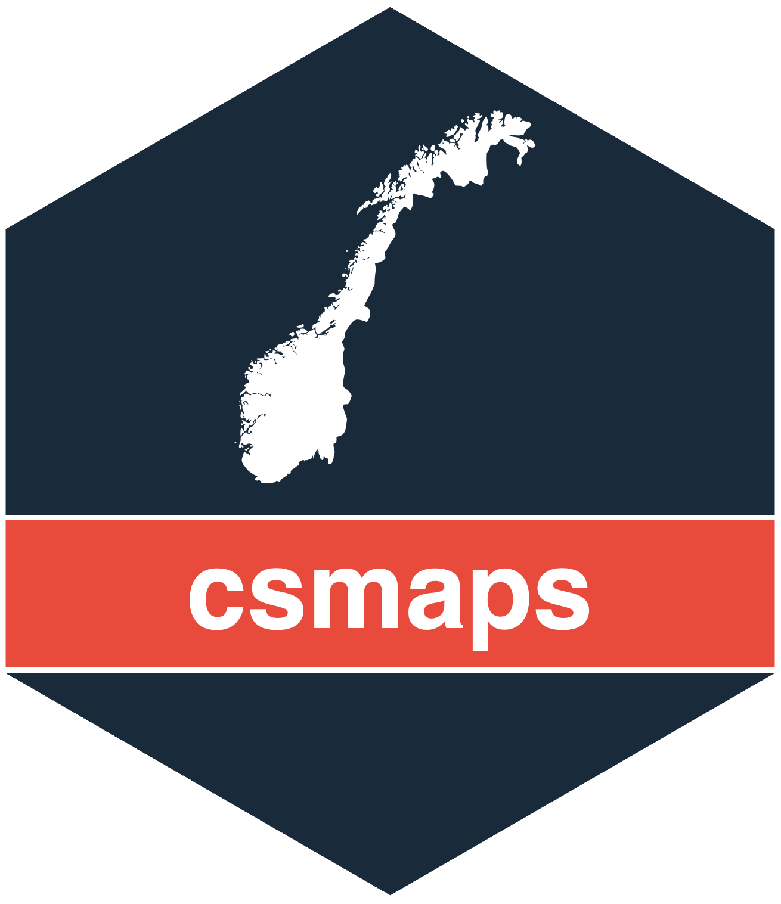

# csmaps <a href="https://www.csids.no/csmaps/"></a>


## Overview 

[csmaps](https://www.csids.no/csmaps/) provides preformatted maps of Norway that generally do not need geolibraries. It helps public health reporting purposes for different geographic levels in Norway.

The following geographic granularities are included: 

* County

* Municipality

* City ward (only for Oslo)

It is convenient to visualize maps with additional information, either using text labels or color palettes.

Read the introduction vignette [here](https://www.csids.no/csmaps/articles/csmaps.html) or run `help(package="csmaps")`.

## csverse

<a href="https://www.csids.no/packages.html"></a>

The [csverse](https://www.csids.no/packages.html) is a set of R packages developed to help solve problems that frequently occur when performing infectious disease surveillance.

If you want to install the dev versions (or access packages that haven't been released on CRAN), run `usethis::edit_r_profile()` to edit your `.Rprofile`. 

Then write in:

```
options(
  repos = structure(c(
    CSVERSE = "https://www.csids.no/drat/",
    CRAN    = "https://cran.rstudio.com"
  ))
)
```

Save the file and restart R.

You can now install [csverse](https://www.csids.no/packages.html) packages from our [drat repository](https://www.csids.no/drat/).

```
install.packages("csmaps")
```

